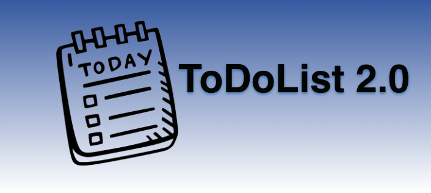
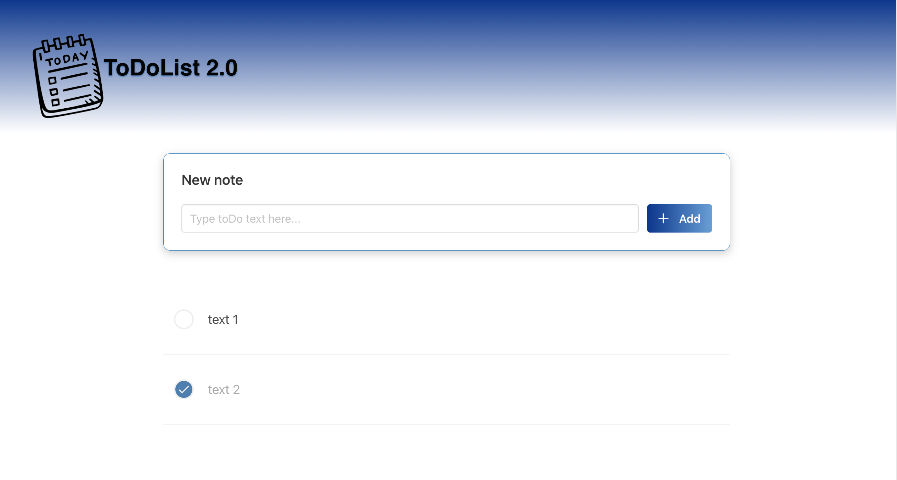

# 

ToDo List app

## Starting 🚀

- Clone or download Git Repository.
- Paste or unzip https://github.com/devFdom/ToDoList2.0
- Open the VS Code.
- Enjoy.

See **Installation** to learn how to deploy the project.

### Requeriments 📋

- VS Code.
- Browser.

### Installation 🔧

- Open VS Code.
- Git clone https://github.com/devFdom/ToDoList2.0 or
- https://to-do-list-2-0.vercel.app/
- Enjoy.

### Coding style tests ⌨️

Verifies the proper functioning of the web with the technologies applied to it.

# 

## Tools 🛠️

* [Visual Studio Code]([https://github.com](https://code.visualstudio.com/)) - Keeping track of changes in computer files.
* [Git & GitHub](https://github.com) - Keeping track of changes in computer files including coordinating team work.

## License 📄

This project is licensed under the (devFdom) License - see the file [LICENSE.md](LICENSE.md) for details.

## Thanks 🎁

* Tell others about this project 📢
* Invite someone from the team to a beer 🍺 or a coffee ☕. If you are very grateful, Audi or BMW 🚗 we accept it too.
* Give thanks publicly 🤓.
* etc.

---
